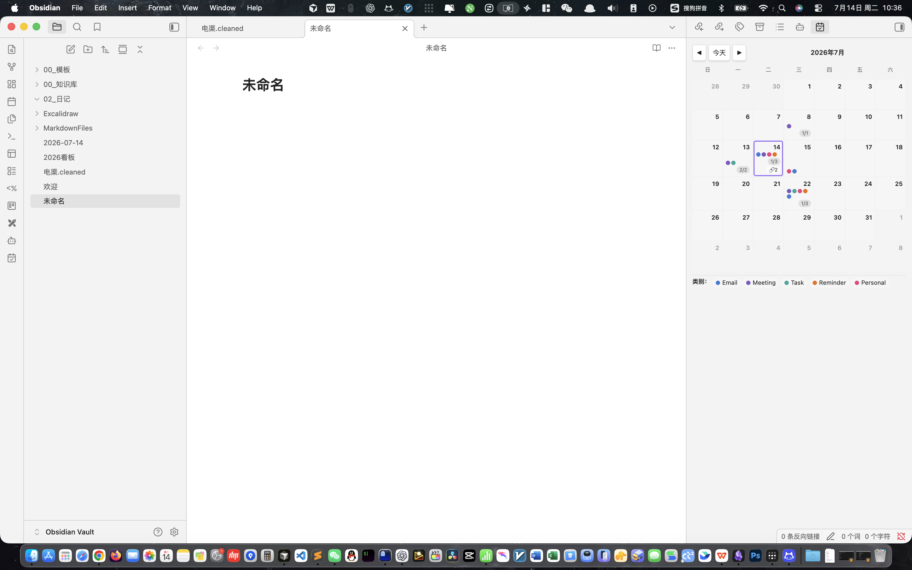
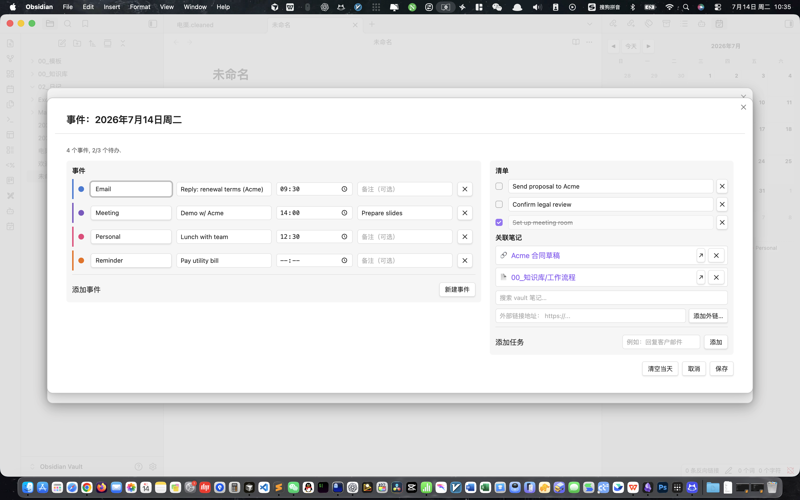

# Calendar Events (Obsidian plugin)

A sidebar calendar for Obsidian where every day holds color-coded events, a checklist, and **linked notes**. Bilingual UI (English + 中文).




## Features

- **Sidebar monthly calendar** — opens in the right pane of Obsidian (`Open Calendar` ribbon icon or the `Calendar Events: Open Calendar sidebar` command).
- **Click any day** — opens a wide day editor with three sections: **Events**, **Checklist**, **Linked notes**.
- **Color-coded events** — five built-in categories (Email / Meeting / Task / Reminder / Personal). Add, rename, recolor, or delete categories from the settings tab.
- **Per-event row layout (v0.3.1)** — category select · title · time · delete button all fit on a single line; the **note** input shares its row with the ✕ **delete** button.
- **Checklist per day** — checkbox + free-text, with a `done/total` counter badge on the calendar cell.
- **Linked notes per day (v0.3.0)** — search any vault note via Obsidian's `AbstractInputSuggest`, or paste an external `https://` URL.
- **Calendar cell badges** — days with events show colored dots; days with checklists show `done/total`; days with linked notes show `🔗N`.
- **Bilingual UI** — choose **Auto** / **English** / **中文** in Settings → Calendar Events → Language. Date titles use `Locale` correctly.
- **Settings tab** — language, week start, category management, JSON export/import.
- **Single-file JSON store** at `<vault>/calendar-data.json`. Easy to back up, easy to diff.

## Installation

1. Download `calendar-events.zip` from the latest [release](https://github.com/fuss228/Calendar-Events/releases).
2. Unzip into `<your-vault>/.obsidian/plugins/calendar-events/` (you should end up with `main.js`, `manifest.json`, `styles.css`, `versions.json`).
3. In Obsidian: **Settings → Community plugins → enable Calendar Events**.

## Commands

| Command | Description |
| --- | --- |
| Open Calendar sidebar | Reveals or creates the right-pane calendar view |
| Edit today's events  | Opens the day editor for the current date |
| Jump to today        | Opens the sidebar and focuses on the current month |

## Data shape

`calendar-data.json` in the vault root:

```json
{
  "version": 1,
  "categories": [
    { "id": "email",   "label": "Email",   "color": "#3a7bd5" },
    { "id": "meeting", "label": "Meeting", "color": "#7e57c2" }
  ],
  "days": {
    "2026-07-14": {
      "events": [
        { "id": "ev_xxx", "title": "Reply: renewal terms", "type": "email", "time": "09:30" }
      ],
      "checklist": [
        { "id": "chk_xxx", "text": "Send proposal", "done": false }
      ],
      "notes": [
        { "id": "note_a", "title": "Acme contract", "path": null,                  "url": "https://example.com/acme.pdf" },
        { "id": "note_b", "title": "Workflow",      "path": "00_知识库/工作流程",  "url": null }
      ]
    }
  }
}
```

`path` (vault note) and `url` (external) are mutually exclusive. Backwards compatible — loading a file without the `notes` field migrates it automatically.

## Build from source

```bash
npm install
npm run build
```

This produces `main.js` and `styles.css` in the project root. Drop them into your vault's plugin folder.

## License

MIT — see [LICENSE](./LICENSE).
